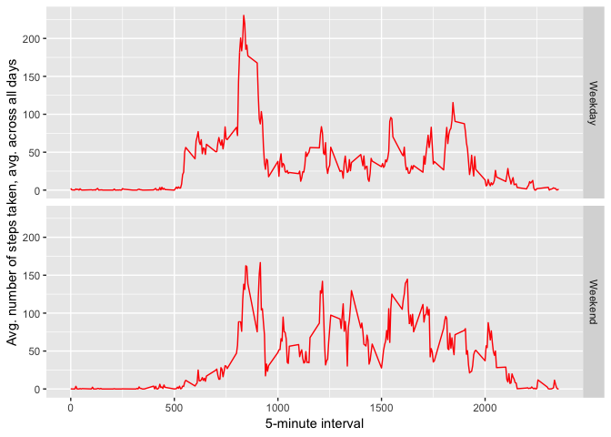

### Loading and preprocessing the data


```r
##Defining Library for the program
library(dplyr)
```

```
## 
## Attaching package: 'dplyr'
```

```
## The following objects are masked from 'package:stats':
## 
##     filter, lag
```

```
## The following objects are masked from 'package:base':
## 
##     intersect, setdiff, setequal, union
```

```r
library(ggplot2)
library(scales)
##clean up R memory before executing the code
rm(list=ls())
## Set Working Directory
setwd("~/Documents/Coursera/5/Wk2/")
##1. Code for reading in the dataset and/or processing the data
temp <- tempfile()
download.file("https://d396qusza40orc.cloudfront.net/repdata%2Fdata%2Factivity.zip",temp)
## Read full data
fitness_data <- read.csv(unz(temp, "activity.csv"), header = TRUE)
unlink(temp)
rm(temp)
fitness_data$date <- as.Date(fitness_data$date)
fitness_data_clean <- na.omit(fitness_data)
```


### What is mean total number of steps taken per day?


```r
fitness_summary <- fitness_data_clean %>% 
        group_by(date) %>% 
        summarise(total=sum(steps))
mean(fitness_summary$total)
```

```
## [1] 10766.19
```

```r
median(fitness_summary$total)
```

```
## [1] 10765
```

<!-- -->


### What is the average daily activity pattern?


<!-- -->


```r
head(fitness_data_clean %>%
             select(steps,interval) %>%
             group_by(interval) %>%
             summarise(step = mean(steps)) %>%
             arrange(desc(step)),1)
```

```
## # A tibble: 1 x 2
##   interval  step
##      <int> <dbl>
## 1      835  206.
```


### Imputing missing values


```r
## total data that is NA
sum(is.na(fitness_data))
```

```
## [1] 2304
```

```r
## % data that is NA
print((1- mean(complete.cases(fitness_data)))*100)
```

```
## [1] 13.11475
```

```r
## Create a new Data set to replace the NA values.
fitness_data_na <- fitness_data
##Calculate the mean values and transform the data as a new column.
fitness_data_na <- transform(fitness_data_na, steps_av = ave(steps,interval,
                                                             FUN=function(x) mean(x,na.rm=TRUE)))
##replace the data where it is NA
fitness_data_na <- transform(fitness_data_na, steps =ifelse(is.na(steps),steps_av,steps))
##Delete the additional column steps_av
fitness_data_na <- select(fitness_data_na, -steps_av)
```


```r
##7. Histogram of the total number of steps taken each day after missing values are imputed
fitness_summary_na <- fitness_data_na %>% 
        group_by(date) %>% 
        summarise(total=sum(steps))
ggplot(fitness_summary_na,aes(total)) +
        geom_histogram(binwidth=2500, fill="grey60", color="black")+
        xlab ("Total number of steps per day") + 
        ylab ("Count")
```

<!-- -->

```r
## Mean and median number of steps taken each day for the dataset where we added missing values
mean(fitness_summary_na$total)
```

```
## [1] 10766.19
```

```r
median(fitness_summary_na$total)
```

```
## [1] 10766.19
```


### Are there differences in activity patterns between weekdays and weekends?


```r
##8. Panel plot comparing the average number of steps taken per 5-minute interval across weekdays and weekends
fitness_data_na_wk <- fitness_data_na
fitness_data_na_wk$week <- ifelse(weekdays(fitness_data_na_wk$date) %in% c("Saturday", "Sunday"), "Weekend", "Weekday")
```

<!-- -->
